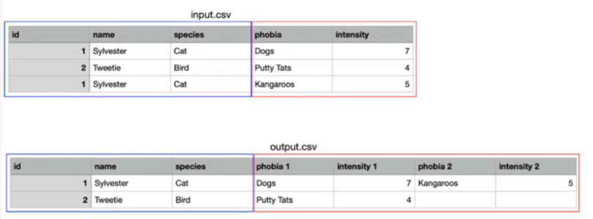

# Processor

## Success

- [ ] Output every unique entry should have only a single row in the output
- [ ] If a unique entry has more than one row, the contents of both rows should be merged if the cell's data is different
- [ ] Only merge data from columns that have a difference in data through the whole file.

## Apporaches

 - `duplicatable` Make an array of colum names which at any point in the file have a difference in a unique id's row
 - Perform merge
    - Find where user id's are on multiple rows `multi_entry_finder`
    - `merger` takes results for `multi_entry_finder` and performs a merge using `duplicateble` as a limit to what it should merge.
    - csv <<

